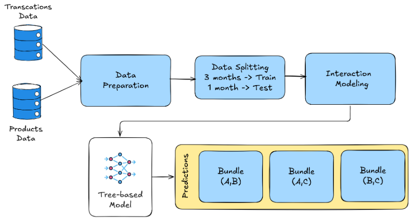
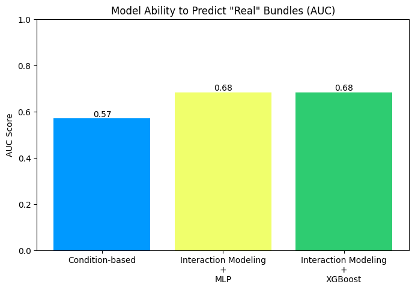
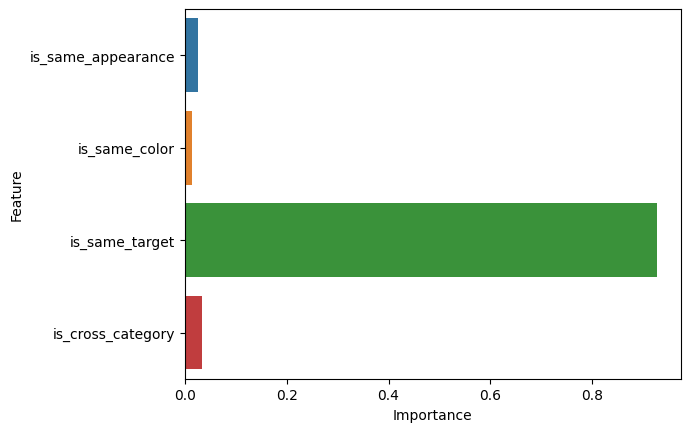
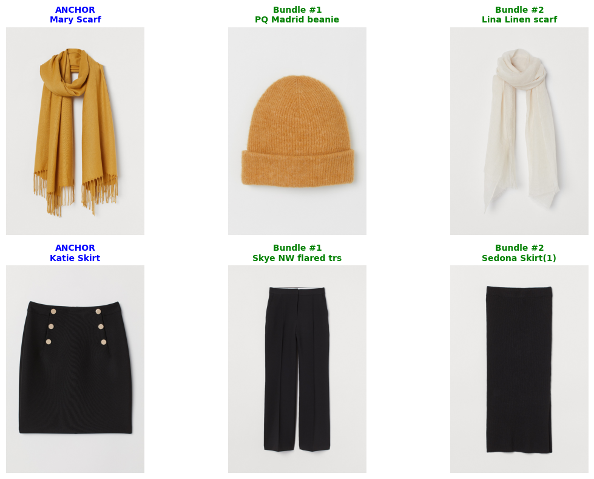

# Fashion Bundle Recommendation

## Purpose

While traditional focus on *"what user likes"*, this product bundling framework focuses on *"what makes the business sense"* which leads to:

1. Increasing the Average Order Value (AOV)
1. Maximize inventory management and clearing dead stock
1. Operational efficiency such as reducing shipping margins

## Dataset

Dataset used in this project is public dataset: [H&M Personalized Fashion Recommendations](https://www.kaggle.com/competitions/h-and-m-personalized-fashion-recommendations/data)

H&M Group is a family of brands and businesses with 53 online markets and approximately 4,850 stores. 

## Framework Design

## Experiment Results

### 1. How interaction modeling with machine learning drives the results?

### 2. What feature is importance for creating the bundles?

### 3. How relevant is the generated bundles?

### 4. Can the bundle recommendation actually increase revenue or AOV?
